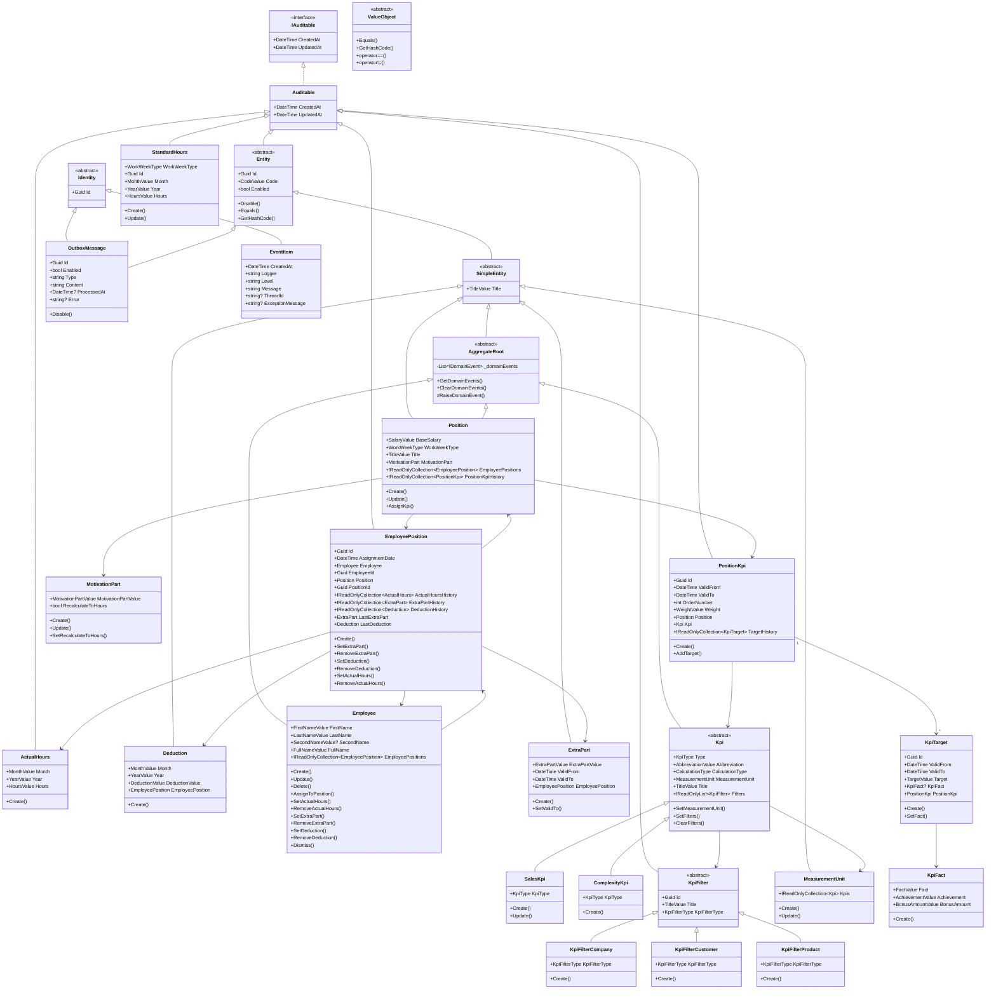

markdown
---

```mermaid

classDiagram
    %% Базовые классы
    class Identity {
        <<abstract>>
        +Guid Id
    }

    class IAuditable {
        <<interface>>
        +DateTime CreatedAt
        +DateTime UpdatedAt
    }

    class Auditable {
        +DateTime CreatedAt
        +DateTime UpdatedAt
    }

    class Entity {
        <<abstract>>
        +Guid Id
        +CodeValue Code
        +bool Enabled
        +Disable()
        +Equals()
        +GetHashCode()
    }

    class SimpleEntity {
        <<abstract>>
        +TitleValue Title
    }

    class AggregateRoot {
        <<abstract>>
        -List~IDomainEvent~ _domainEvents
        +GetDomainEvents()
        +ClearDomainEvents()
        #RaiseDomainEvent()
    }

    class ValueObject {
        <<abstract>>
        +Equals()
        +GetHashCode()
        +operator==()
        +operator!=()
    }

    %% Сущности (Entity)
    class ActualHours {
        +MonthValue Month
        +YearValue Year
        +HoursValue Hours
        +Create()
    }

    class Deduction {
        +MonthValue Month
        +YearValue Year
        +DeductionValue DeductionValue
        +EmployeePosition EmployeePosition
        +Create()
    }

    class Employee {
        +FirstNameValue FirstName
        +LastNameValue LastName
        +SecondNameValue? SecondName
        +FullNameValue FullName
        +IReadOnlyCollection~EmployeePosition~ EmployeePositions
        +Create()
        +Update()
        +Delete()
        +AssignToPosition()
        +SetActualHours()
        +RemoveActualHours()
        +SetExtraPart()
        +RemoveExtraPart()
        +SetDeduction()
        +RemoveDeduction()
        +Dismiss()
    }

    class EmployeePosition {
        +Guid Id
        +DateTime AssignmentDate
        +Employee Employee
        +Guid EmployeeId
        +Position Position
        +Guid PositionId
        +IReadOnlyCollection~ActualHours~ ActualHoursHistory
        +IReadOnlyCollection~ExtraPart~ ExtraPartHistory
        +IReadOnlyCollection~Deduction~ DeductionHistory
        +ExtraPart LastExtraPart
        +Deduction LastDeduction
        +Create()
        +SetExtraPart()
        +RemoveExtraPart()
        +SetDeduction()
        +RemoveDeduction()
        +SetActualHours()
        +RemoveActualHours()
    }

    class ExtraPart {
        +ExtraPartValue ExtraPartValue
        +DateTime ValidFrom
        +DateTime ValidTo
        +EmployeePosition EmployeePosition
        +Create()
        +SetValidTo()
    }

    class Kpi {
        <<abstract>>
        +KpiType Type
        +AbbreviationValue Abbreviation
        +CalculationType CalculationType
        +MeasurementUnit MeasurementUnit
        +TitleValue Title
        +IReadOnlyList~KpiFilter~ Filters
        +SetMeasurementUnit()
        +SetFilters()
        +ClearFilters()
    }

    class SalesKpi {
        +Create()
        +Update()
        +KpiType KpiType
    }

    class ComplexityKpi {
        +Create()
        +KpiType KpiType
    }

    class KpiFilter {
        <<abstract>>
        +Guid Id
        +TitleValue Title
        +KpiFilterType KpiFilterType
    }

    class KpiFilterCompany {
        +Create()
        +KpiFilterType KpiFilterType
    }

    class KpiFilterCustomer {
        +Create()
        +KpiFilterType KpiFilterType
    }

    class KpiFilterProduct {
        +Create()
        +KpiFilterType KpiFilterType
    }

    class MeasurementUnit {
        +IReadOnlyCollection~Kpi~ Kpis
        +Create()
        +Update()
    }

    class MotivationPart {
        +MotivationPartValue MotivationPartValue
        +bool RecalculateToHours
        +Create()
        +Update()
        +SetRecalculateToHours()
    }

    class OutboxMessage {
        +Guid Id
        +bool Enabled
        +string Type
        +string Content
        +DateTime? ProcessedAt
        +string? Error
        +Disable()
    }

    class Position {
        +SalaryValue BaseSalary
        +WorkWeekType WorkWeekType
        +TitleValue Title
        +MotivationPart MotivationPart
        +IReadOnlyCollection~EmployeePosition~ EmployeePositions
        +IReadOnlyCollection~PositionKpi~ PositionKpiHistory
        +Create()
        +Update()
        +AssignKpi()
    }

    class PositionKpi {
        +Guid Id
        +DateTime ValidFrom
        +DateTime ValidTo
        +int OrderNumber
        +WeightValue Weight
        +Position Position
        +Kpi Kpi
        +IReadOnlyCollection~KpiTarget~ TargetHistory
        +Create()
        +AddTarget()
    }

    class KpiTarget {
        +Guid Id
        +DateTime ValidFrom
        +DateTime ValidTo
        +TargetValue Target
        +KpiFact? KpiFact
        +PositionKpi PositionKpi
        +Create()
        +SetFact()
    }

    class KpiFact {
        +FactValue Fact
        +AchievementValue Achievement
        +BonusAmountValue BonusAmount
        +Create()
    }

    class StandardHours {
        +WorkWeekType WorkWeekType
        +Guid Id
        +MonthValue Month
        +YearValue Year
        +HoursValue Hours
        +Create()
        +Update()
    }

    class EventItem {
        +DateTime CreatedAt
        +string Logger
        +string Level
        +string Message
        +string? ThreadId
        +string? ExceptionMessage
    }

    %% Наследование
    Identity <|-- EventItem
    Identity <|-- OutboxMessage

    IAuditable <|.. Auditable
    Auditable <|-- Entity
    
    Entity <|-- SimpleEntity
    Entity <|-- OutboxMessage
    
    SimpleEntity <|-- AggregateRoot
    SimpleEntity <|-- Deduction
    SimpleEntity <|-- ExtraPart
    SimpleEntity <|-- MeasurementUnit
    SimpleEntity <|-- Position
    
    Auditable <|-- ActualHours
    Auditable <|-- EmployeePosition
    Auditable <|-- KpiFilter
    Auditable <|-- PositionKpi
    Auditable <|-- StandardHours

    AggregateRoot <|-- Kpi
    AggregateRoot <|-- Position
    AggregateRoot <|-- Employee

    Kpi <|-- SalesKpi
    Kpi <|-- ComplexityKpi

    KpiFilter <|-- KpiFilterCompany
    KpiFilter <|-- KpiFilterCustomer
    KpiFilter <|-- KpiFilterProduct

    %% Связи (Associations)
    EmployeePosition --> Employee
    EmployeePosition --> Position
    EmployeePosition --> ExtraPart
    EmployeePosition --> Deduction
    EmployeePosition --> ActualHours

    Employee --> EmployeePosition
    Position --> EmployeePosition
    Position --> MotivationPart
    Position --> PositionKpi

    PositionKpi --> Kpi
    PositionKpi "1" --> "*" KpiTarget

    KpiTarget --> KpiFact
    Kpi --> MeasurementUnit
    Kpi --> KpiFilter

```
---
